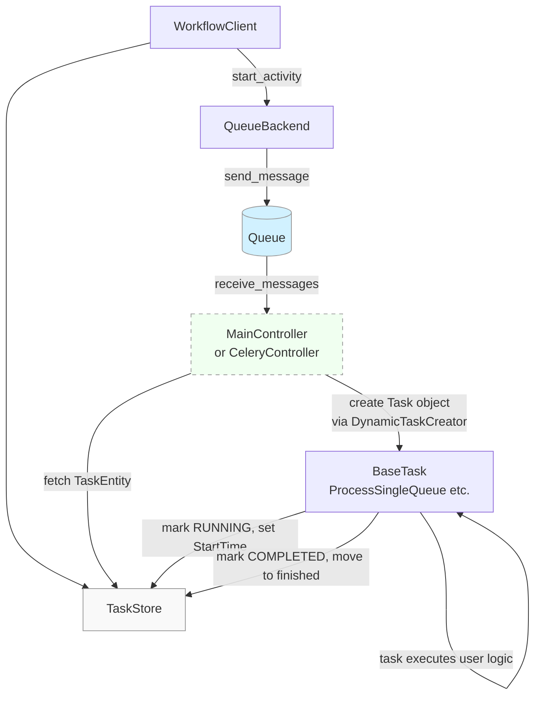

# Overall Framework Mermaid Diagram

### Explanation

- **WorkflowClient:**  
  Initiates task creation by calling `start_activity`, which interacts with both the QueueBackend and TaskStore.

- **QueueBackend:**  
  Handles sending messages (to a queue) that are then received by the controller (either `MainController` or `CeleryController`).

- **TaskStore:**  
  Stores task entities, including both active and finished tasks.

- **MainController / CeleryController:**  
  Receives messages from the queue.  
  - `MainController` polls, retrieves the task entity from the store, and uses `DynamicTaskCreator` to create the appropriate task instance (a subclass of `BaseTask` such as `ProcessSingleQueue`).  
  - `CeleryController` delegates task execution to Celery workers.

- **BaseTask / ProcessSingleQueue:**  
  Implements task-specific logic (e.g., marking tasks as RUNNING, COMPLETED, or ERROR) and updates the task store accordingly.

The diagram uses custom class styles to visually distinguish the TaskStore (`storeFill`) and the Queue (`queueFill`), while the Controller is highlighted with a dashed outline.

This diagram provides an overall view of the task processing flow within the system.
