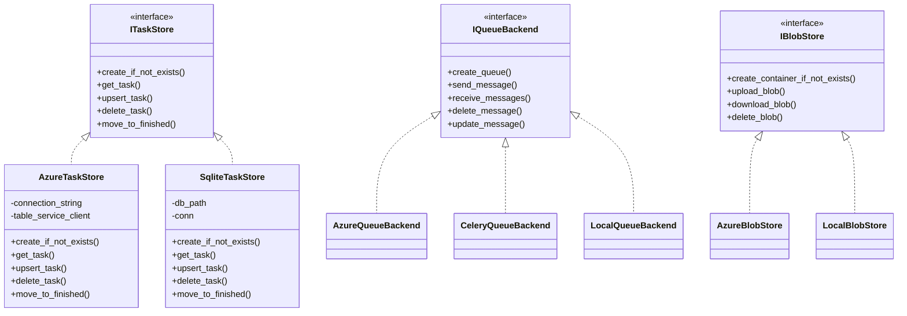

# `storage` Component Documentation

## Purpose

Encapsulates data persistence (tables), messaging (queues), and blob/file handling. Provides pluggable interfaces plus Azure and local implementations.

### Sub-Packages

1. **`tables`**
   - **`ITaskStore`**: Interface for create/read/update tasks.  
   - **`AzureTaskStore`**: Uses Azure Table Storage.  
   - **`SqliteTaskStore`**: Uses a local SQLite DB.  
   - **`TaskStoreFactory`**: Chooses Azure vs. SQLite based on environment/config.

2. **`queue`**
   - **`IQueueBackend`**: Interface for queue operations.  
   - **`AzureQueueBackend`**: Azure Storage Queue.  
   - **`CeleryQueueBackend`**: Sends tasks directly to Celery.  
   - **`LocalQueueBackend`**: In-memory queue (ideal for local testing).

3. **`blobs`**
   - **`IBlobStore`**: Interface for upload/download of binary data.  
   - **`AzureBlobStore`**: For Azure Storage Blobs.  
   - **`LocalBlobStore`**: Simple local filesystem storage.

## Usage Example

```python
from background_workflows.storage.tables.task_store_factory import TaskStoreFactory
from background_workflows.storage.queue.local_queue_backend import LocalQueueBackend

factory = TaskStoreFactory(store_mode="sqlite")
task_store = factory.get_task_store()
queue_backend = LocalQueueBackend()
```

## mermaid

