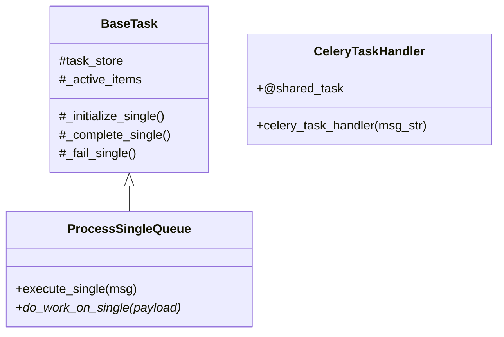

# `tasks` Component Documentation

## Purpose

Base classes for actual “work” logic. Provides:

- **`BaseTask`**:  
  - Abstract class that defines `_initialize_single()`, `_complete_single()`, `_fail_single()` for reading/updating the `TaskEntity`.

- **`ProcessSingleQueue`**:  
  - A subclass that provides a template for single-message handling.  
  - Child classes override `do_work_on_single(payload)` with custom logic.  
  - `execute_single(msg)` auto-manages start/end times, status updates, etc.

- **`celery_task.py`**  
  - A Celery shared task that, upon receiving a message, uses the `DynamicTaskCreator` to run the correct task code.

## Using a Custom Task

```python
from background_workflows.tasks.process_single_queue import ProcessSingleQueue
from background_workflows.utils.decorators import register_activity
import json

@register_activity("MY_CUSTOM_TASK")
class MyCustomTask(ProcessSingleQueue):
    def do_work_on_single(self, payload):
        # payload is a dict of your inputs
        # do something ...
        result = {"answer": 42}
        return json.dumps(result)
```

## Mermaid Diagram

