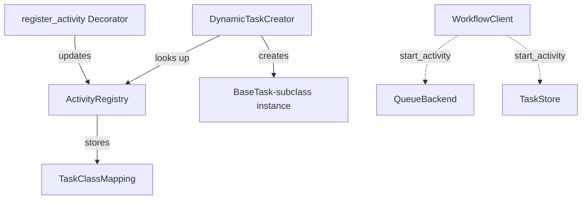

# `utils` Component Documentation

## Purpose

Collection of shared tools and helper classes that tie everything together.

### Modules

1. **`activity_registry.py`**  
   - `ActivityRegistry`: A global dictionary mapping `activity_type` -> `TaskClass`.

2. **`decorators.py`**  
   - `@register_activity(activity_type)`: Decorator that automatically registers a `BaseTask` subclass with `ActivityRegistry`.

3. **`dynamic_task_creator.py`**  
   - `DynamicTaskCreator`: Given a `TaskMessage`, it looks up the appropriate registered task class and instantiates it.

4. **`task_logger.py`**  
   - Sets up a default logger with the format/level specified in `AppConstants.Logging`.

5. **`workflow_client.py`**  
   - A high-level facade that hides queue/table details from end users.
   - `start_activity(...)` creates a task entity, enqueues a message, and returns a `row_key`.
   - `get_status(row_key, resource_id)` checks the task status.  
   - `get_result(row_key, resource_id)` fetches final output once completed.

## Mermaid Diagram

